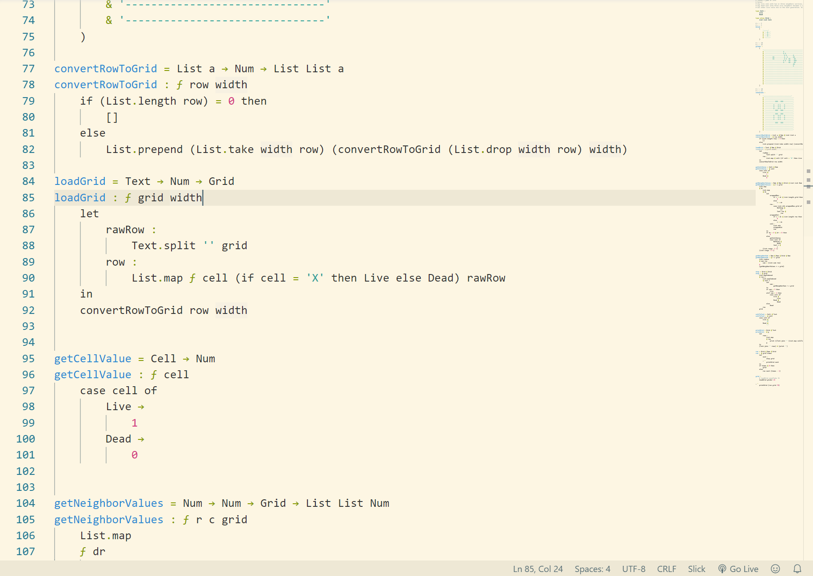

# Slick


# Introduction

Slick is a statically typed functional programming language transpiled to JavaScript.

Slick aims to *unclutter* software development and is heavily influenced by [Elm](https://elm-lang.org/) and [Neo](https://github.com/douglascrockford/howjavascriptworks).

# Hello World

```
_ :
	print 'Hello World!'
```

`_`  is the placeholder symbol for a binding name. You can repeatedly use `_` in your code to render side effects such as printing to the console.

`print` is the built-in function to print any value to standard output.

Function invocations use space to separate callee and arguments instead of parentheses to avoid parenthesis hell.

# Comments

```
# Slick only has single-line comments

# Combine multiple
# single-line comments
# to form a multi-line comment
```

# Primitive Types

Slick only has three primitive types:

## Num

### How are numbers represented?

Numbers in Slick are all arbitrary precision (by default to 20 significant figures) floating point numbers. There is not separate integer type to avoid type complexity and unnecessary type conversion between integers and floats. Unlike most languages, Slick does not suffer from floating point rounding errors so all calculations are accurate up to 20 significant figures. (you can change the number of sig figs in the compiler setting in the future).

### How can I work with `Num`?

Infix operators:

```
+, -, *, / for add, subtract, multiply, and divide
% for modulo (getting the remainder of dividing two numbers)
```

Math functions see reference.

## Text

Texts in Slick are lists of Unicode codepoints surrounded with `'`s (single quotes). 

### Why no `char` type?

Unlike languages like C and Java, Slick does not have a `char` type because one user-perceived character like 'ñ' may consists of multiple Unicode codepoints (n+◌̃ ) thus a character needs to be stored as a list of codepoints. A list of Unicode codepoints is exactly what `Text` is so there's no point in creating a separate type. 

### How can I work with `Text`?

You still have all the familiar operations like `slice` and `length` but they now have *user-perceived characters* as unite of operation instead of Unicode codepoints. So calling `length` on `अनुच्छेद` returns 5 because the text contains just 5 user-perceived characters (अ + नु + च् + छे + द) instead of 8 Unicode codepoints (अ + न + ु + च + ् + छ + े + द). The rules for splitting text into user-perceived characters follows the Unicode standard [UAX #29](http://www.unicode.org/reports/tr29/).

You can concatenate two texts using `&`:

```
print ('Hello ' & 'world!') # Hello world!
```

## Bool

Booleans in Slick are either `True` or `False`.

### How can I work with `Bool`?

```
True ⋏ False = False # ('⋏' for and operator)
True ⋎ False = True # ('⋎' for or operator)
```

In the code editor, type `/\` to create `⋏` and `\/` to create `⋎`.

# Bindings

```
name :
	'Bob'
```

Bindings are immutable. The value of the binding must be on the next line after the `:` (colon) for consistent code style. Function expression is an exception. Function header must be on the same line as the `:`.

```
# Valid binding names
foo
longBindingNme

# Invalid binding names
long_binding_name # Use camelCase instead of '_'
$bindingName # No symbols other than '?' are permitted
Foo # binding name can only start with lowercase
    # uppercase reserved for type names
```

# Functions

```
add : ƒ a b
	a + b
```

All functions in slick are expressions and starts with the `ƒ` symbol. Notice that the `ƒ` is italic, not a normal `f`. You can use keyboard shorthand `\f` in the code editor to type `ƒ` (see how to install Slick VS Code extension). Put any parameters after `ƒ` and separate each with a space. The function body is an expression and Slick evaluates that expression to produce the function return value.

```
add = Num → Num → Num
add : ƒ a b
	a + b
```

We recommend putting a type declaration above the function. Adding type declaration both confirms that the type you think the function possesses is correct and serves as compiler-verified documentation for the function. In Slick, we don't specially highlight the return type of the function in its type declaration. Instead, we chain all parameter types and the return type together with `→` (keyboard shorthand `->` ). The reason for this is because all functions in Slick are [curried](https://medium.com/javascript-scene/curry-and-function-composition-2c208d774983) and the `→` separated type declaration allows [partial applications](https://scotch.io/tutorials/javascript-functional-programming-explained-partial-application-and-currying) on all functions.

Another way to declare short functions is to surround the function body with `()` without a line break after the function header:

```
add = Num → Num → Num
add : ƒ a b (a + b)
```

# Records

```
bob :
    {
        name : 'Bob'
        age: 45
        employeed: True
    }
```

Record maps a `Text` key to a value of any type. No duplicate keys are allowed.

You can access record property using the `.`  (dot) operator

```
# 'Bob'
name :
	bob.name
```

Records are immutable. Use `|`  (bar) to update record property:

```
alice :
    {
        bob |
        name : 'Alice'
    }
```

The `alice` record is created by updating the `name` property of record `bob` to `'Alice'`.

# Lists

```
list:
	[1, 2, 3]
```

Lists are immutable and can only contain values of same type.

Here we will only give a simple example. Refer to the API documentation in the end for more details.

Create a list of even numbers from 1 to 10:
```
evenList :
	List.filter # calls the List.filter function
	ƒ element (element % 2 = 0) # keep only even elements in the list
	(List.range 1 10) # create a list ranging from 1 to 10
```
Notice that function calls can span multiple lines. Here we are calling `List.filter` function with a function that keeps even elements and a list produced by `List.range`.

# If Expression

```
value :
	0

valueName :
    if value > 0
        'positive'
    elif value = 0
        'zero'
    else
        'negative'
_ :
	# outputs 'value is zero'
	print ('value is ' & valueName)
		
```

# Type Aliases

Slick is all about data structures. All program states are stored using data structures (or Abstract Data Types, ADTs). Sometimes you may find yourself repeat the type names of an ADT as you use them throughout the program, then it's the time to introduce a `type alias` for that ADT.

```
# Grid stands for a 2-dimensional list of numbers
type alias Grid :
	List List Num
```

Type aliases help maintain the DRY (Don't Repeat Yourself) principle in your code and make refactoring the ADT much easier later.

# Custom Types

Primitive data types - `Bool`, `Text`, and `Num` - usually do the job. However, many properties do not fit nicely into the three primitive types. For example, you may want to represent day of the week in your program. At first, you may be tempted to just settle with `Text`:

```
dayOfWeek :
	'Friday'
```

However, too many things that are not day of week can be stored in `Text` :

```
dayOfWeek :
	'hello'
```

You may be satisfied with using the `Text` representation until you want to convert `dayOfWeek` to a number:

```
dayOfWeek :
	'monday'

dayNumber :
	if dayOfWeek = 'Sunday' then
		0
	elif dayOfWeek = 'Monday' then
		1
	elif dayOfWeek = 'Tuesday' then
		2
	elif dayOfWeek = 'Wednesday' then
		3
    elif dayOfWeek = 'Thursday' then
		4
	elif dayOfWeek = 'Friday' then
		5
	else
		6
```

Now there are a lot of `elif`s and `then`s. Let's simplify this `if-elif-else` chain with `case` expression.

```
dayOfWeek :
	'monday'

dayNumber :
	case dayOfWeek of
		'Sunday' →
			0
		'Monday' →
			1
		'Tuesday' →
			2
		'Wednesday' →
			3
		'Thursday' →
			4
		'Friday' →
			5
		_ →
			6
```

What we did is basically extracting the `dayOfWeek` binding to the top of the `case` expression, remove the `if`, `elif`s, and `else`s, and replace `then` with `→`. Notice the last `_` (underscore) placeholder? That just means `else`.

All looks good but oops! All of a sudden, `dayNumber` yields `6` when `dayOfWeek` is `monday` instead of the correct result `1` because `monday ≠ Monday` and we drop all the way to the bottom `_` catch-all else case. This kind of bug is also very hard to catch because the programming logic is perfect except for a single character.

Is this the best we can do?

No!

Enter custom types 👏👏👏

You can create a custom `DayOfWeek` type to precisely capture all seven days of the week with no room for invalid states:

```
type DayOfWeek :
	Sunday
	Monday
	Tuesday
	Wednesday
	Thursday
	Friday
	Saturday
```

Well, what's special about this? Now, you can't need to worry about invalid day of week because they are impossible! The Slick compiler checks it for you to make sure the integrity of the custom type. Let's rewrite the `dayNumber` using new the custom type `DayOfWeek`:

```
dayOfWeek :
	# 'monday' or 'Monday' no longer works because now dayOfWeek is a custom type, not a Text
	Monday

dayNumber :
	case dayOfWeek of
		Sunday →
			0
		Monday →
			1
		Tuesday →
			2
		Wednesday →
			3
		Thursday →
			4
		Friday →
			5
		# if you omit any one DayOfWeek, Slick will not compile the code
		Saturday →
			6

```

# Case Expression

Here's another simple example of how to use case expression on custom types:

```
type Fruit :
	Apple
	Banana
	Orange

fruit :
	Banana

# 0.75
fruitPrice :
	case fruit of
		Apple →
			2
		Banana →
			0.75
		Orange →
			1.5
```

# Install Slick

Create a new npm project using:

```bash
npm init
```

Now your project tree should look like:

```
package-lock.json
package.json
```

Create a `src` folder:

```
src/
package-lock.json
package.json
```

Add `helloWorld.slk` to the `src` folder:

```
# helloWorld.slk
_ :
	print 'Hello World from Slick!'
```

Your project should now look like:

```
src/
	|- helloWorld.slk
package-lock.json
package.json
```

Install the slick compiler:

```bash
npm install slick-make
```

Now your project tree should have a `node_modules` folder added by `npm`:

```
node_modules/
src/
	|- helloWorld.slk
package-lock.json
package.json
```

Run you slick program:

```bash
npm run slick run src/helloWorld.slk
```

```
Hello World from Slick!
```

🎉🎉🎉 Congratulation! You just ran you first Slick program!

See the `examples` folder for more examples.

# Set up Slick in Visual Studio Code
Install [slick-vscode-extension](https://marketplace.visualstudio.com/items?itemName=KevinLi.slick-lang) and you are all set with full syntax highlighting and symbol shorthands.



# Symbol Shorthands
|You type   | to get  |
|---|---|
|`\f` |`ƒ`  |
|`->` |`→`  |
|`>=` |`≥`  |
|`<=` |`≤`  |
|`!=` |`≠`  |
|`/\` |`⋏`  |
|`\/` |`⋎`  |


# API functions

## Text functions
```
lower       Text → Text
upper       Text → Text
lower?      Text → Bool
upper?      Text → Bool
nth         Num → Text → Maybe Text
take        Num → Text → Text
takeLast    Num → Text → Text
trim        Text → Text
split       Text → Text → List Text
capitalize  Text → Text
endsWith    Text → Text → Bool
startsWith  Text → Text → Bool
slice       Num → Num → Text → Text
member      Text → Text → Bool
length      Text → Num
char        Num → Maybe Text
join        Text → List Text → Text
```

## List functions
```
map         (a → b) → List a → List b
mapIndexed  (a → Num → b) → List a → List b
filter      (a → Bool) → List a → List a
reject      (a → Bool) → List a → List a
find        (a → Bool) → List a → Maybe a
reduce      (a → b → a) → a → List b → a
reduceLast  (a → b → a) → a → List b → a
all         (a → Bool) → List a → Bool
any         (a → Bool) → List a → Bool
first       List a → Maybe a
tail        List a → List a
head        List a → List a
last        List a → Maybe a
nth         Num → List a → Maybe a
take        Num → List a → List a
takeLast    Num → List a → List a
slice       Num → Num → List a → List a
member      a → List a → Bool
insert      Num → a → List a → List a
append      a → List a → List a
prepend     a → List a → List a
update      Num → a → List a → List a
drop        Num → List a → List a
dropLast    Num → List a → List a
concat      List a → List a → List a
adjust      Num → (a → a) → List a → List a
length      List a → Num
range       Num → Num → List Num
sum         List Num → Num
```

# Num functions
```
abs        Num → Num
max        Num → Num → Num
min        Num → Num → Num
neg        Num → Num
sqrt       Num → Num
round      Num → Num
floor      Num → Num
ceil       Num → Num
trunc      Num → Num
pi         Num
e          Num
sin        Num → Num
cos        Num → Num
tan        Num → Num
asin       Num → Num
acos       Num → Num
atan       Num → Num
atan2      Num → Num → Num
```

# other built-in functions
```
not        Bool → Bool
print      a → Text
```